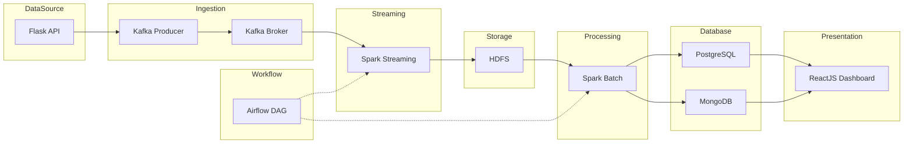

  
  
  
  
  
  
  
  
  
  

<h1 align="center">DATN - Customer Segment Platform</h1>

<strong>Hệ thống xử lý, phân tích dữ liệu khách hàng đa tầng, real-time, trực quan & quản lý phân khúc thông minh</strong>

---

## 📑 Mục lục

- [1. Tổng quan hệ thống](#1-tổng-quan-hệ-thống)
  - [1.1. Nguồn dữ liệu](#11-nguồn-dữ-liệu)
  - [1.2. Thu thập dữ liệu](#12-thu-thập-dữ-liệu)
  - [1.3. Xử lý dữ liệu](#13-xử-lý-dữ-liệu)
  - [1.4. Lập lịch giám sát](#14-lập-lịch-giám-sát)
  - [1.5. Triển khai](#15-triển-khai)
  - [1.6. Nền tảng phân khúc](#16-nền-tảng-phân-khúc)
- [2. Kết quả](#2-kết-quả)
- [3. Demo giao diện](#3-demo-giao-diện)
- [4. Kiến trúc tổng thể](#4-kiến-trúc-tổng-thể)
- [5. Công nghệ sử dụng](#5-công-nghệ-sử-dụng)

---

## 1. Tổng quan hệ thống

### 1.1. Nguồn dữ liệu

- Dataset: [Ecommerce Behavior Data from Multi Category Store](https://www.kaggle.com/datasets/mkechinov/ecommerce-behavior-data-from-multi-category-store)
- Xây dựng Flask Server trả data qua GET Endpoint

### 1.2. Thu thập dữ liệu

- Dữ liệu được Producer gọi và đẩy vào hàng đợi Kafka real-time từng bản ghi một
- Spark Streaming đọc từ luồng Kafka, chuẩn hoá cấu trúc dữ liệu và ghi vào HDFS

### 1.3. Xử lý dữ liệu

- Dữ liệu thô được xử lý, làm sạch, biến đổi thành các chỉ số của hồ sơ khách hàng
- Tính toán chỉ số tổng hợp của từng khách hàng theo từng ngày → tạo dashboard

### 1.4. Lập lịch giám sát

- Quá trình ETL sẽ được lập lịch tự động và quản lý thông qua Apache Airflow

### 1.5. Triển khai

- Docker: Triển khai Flask, Airflow, cụm Kafka, cụm Spark, cụm Hadoop, PostgreSQL, MongoDB

### 1.6. Nền tảng phân khúc

- Phân khúc dựa trên luật: chỉ số + logic AND/OR
- Ứng dụng Web: quản lý hồ sơ, quản lý phân khúc

---

## 2. Kết quả

**Triển khai cụm Kafka**
 

**Triển khai cụm Spark**
 

**Triển khai cụm Hadoop**
 

**DAG Airflow**
 

---

## 3. Demo giao diện

### Quản lý hồ sơ khách hàng

**Tổng quan hồ sơ**
 

**Chi tiết hồ sơ**
 

**Trực quan biểu đồ**
 

### Quản lý phân khúc

 

---

## 4. Kiến trúc tổng thể

**Mô tả luồng dữ liệu:**
- Dữ liệu từ Flask API được Producer đẩy lên Kafka.
- Spark Streaming đọc dữ liệu Kafka, ghi thô vào HDFS (real-time).
- Airflow DAG quản lý toàn bộ pipeline:
    - Trigger Spark Streaming ingest data vào HDFS.
    - Trigger Spark Batch xử lý dữ liệu từ HDFS, transform và ghi kết quả vào PostgreSQL/MongoDB.
- Dashboard ReactJS truy xuất dữ liệu từ các Database để trực quan hóa và quản lý.

---

## 5. Công nghệ sử dụng

| Thành phần      | Công nghệ                   |
|-----------------|----------------------------|
| API nguồn       | Flask, Python              |
| Streaming       | Apache Kafka, Spark        |
| Lưu trữ         | HDFS, PostgreSQL, MongoDB  |
| Xử lý ETL       | Apache Airflow             |
| Triển khai      | Docker Compose             |
| Dashboard       | ReactJS, Ant Design        |

---

⚡ <b>Đồ án tốt nghiệp - Customer Segment Platform</b> ⚡

